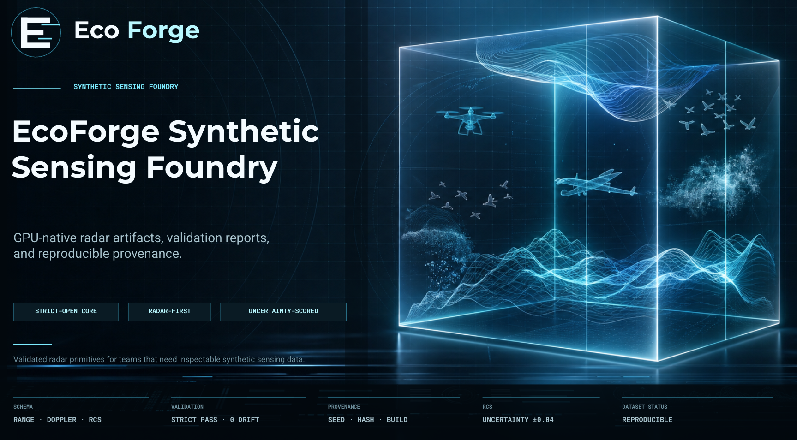
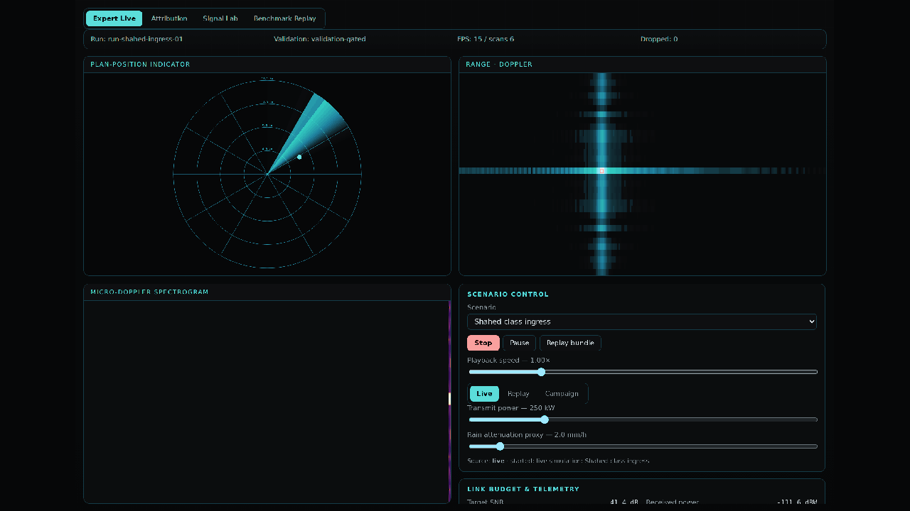
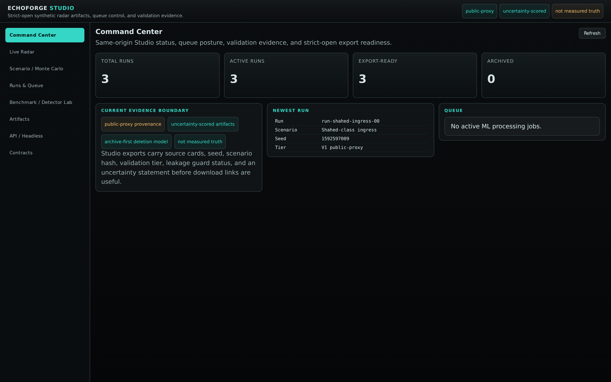
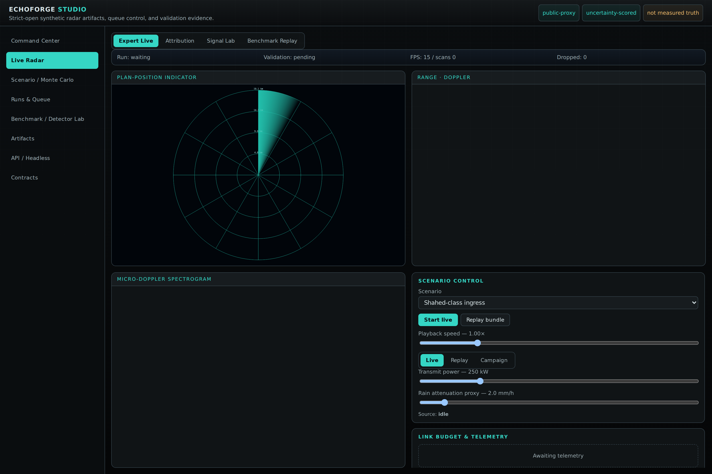
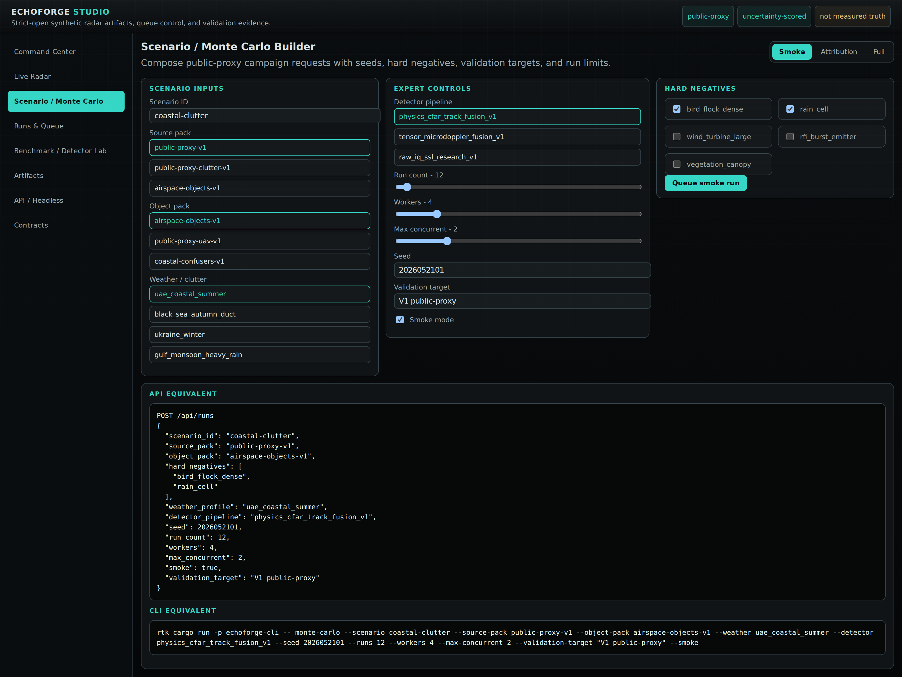
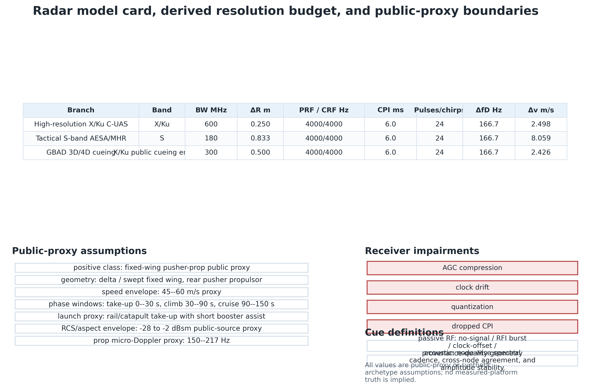
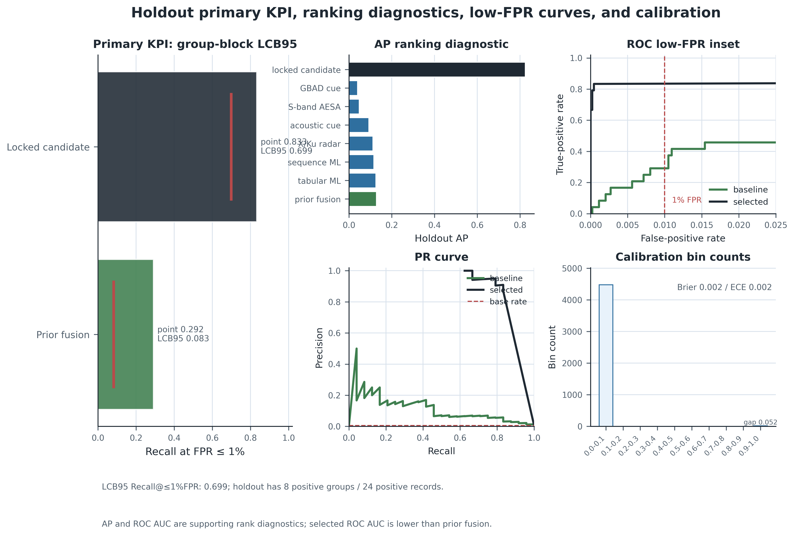
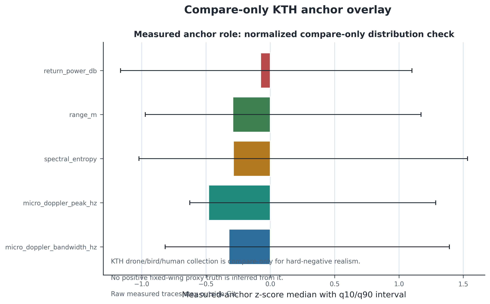

# EchoForge


EchoForge is a strict-open, radar-first, GPU-native synthetic sensing foundry. It publishes public-proxy object signatures, uncertainty-scored radar artifacts, and reproducible validation evidence so downstream work can be inspected, rerun, and compared without claiming measured truth or proprietary-equivalent sensor behavior.

The claim boundary stays narrow: public-source priors only, explicit uncertainty, hard negatives treated as robustness work, and no classified, vendor-private, or exact field-performance claims.
The paper KPI is the lower 95% group-block bootstrap bound of recall at FPR <= 1%, reported as `LCB95 Recall@≤1%FPR`; AP, ROC AUC, calibration, and false-positive burden remain guardrails.

## Studio Preview



EchoForge Studio is a same-origin Rust + Vite interface for live radar playback, Monte Carlo campaign setup, run archive/restore/duplicate workflows, artifact review, and headless API usage. The UI keeps source cards, validation tier, uncertainty language, seed, and scenario hash visible before export.

| Command Center | Live Radar | Monte Carlo Builder |
| --- | --- | --- |
|  |  |  |

README media is tracked under [assets/readme/studio](./assets/readme/studio/) with a deterministic capture manifest at [assets/readme/studio/manifest.json](./assets/readme/studio/manifest.json). Regenerate after a Studio UI change with the same lane used by the post-merge sync:

```bash
rtk bash ops/run-lane.sh studio-sync
```

## Value

- Public-proxy object and scenario packs that are readable as source artifacts, not hidden datasets.
- Detector realism surfaces that separate detection, tracking, classification, and fusion.
- Hard-negative and clutter fixtures that exercise robustness instead of optimizing evasion.
- Validation reports and smoke gates that keep generated outputs reproducible and reviewable.

## What's Included

- Source-pack fixtures: public-proxy dossiers, object cards, physics dossiers, and pack manifests.
- Detector surfaces: detector family matrices, detector cards, detector graphs, and sensor cards.
- Scenario fixtures: public-proxy scenes, airspace-object libraries, and weather profiles.
- Validation surfaces: benchmark reports, phase metrics, and smoke outputs that stay out of Git.

## Sources

- Public-proxy dossier: [object-packs/public-proxy/source_dossier.yaml](./object-packs/public-proxy/source_dossier.yaml), [object-packs/public-proxy/object_card.yaml](./object-packs/public-proxy/object_card.yaml), [object-packs/public-proxy/physics_dossier.md](./object-packs/public-proxy/physics_dossier.md)
- Public-proxy pack manifest: [object-packs/public-proxy/pack.manifest.json](./object-packs/public-proxy/pack.manifest.json)
- Radar platform pack: [object-packs/radar-platforms-v1/pack.manifest.json](./object-packs/radar-platforms-v1/pack.manifest.json), [object-packs/radar-platforms-v1/saab_giraffe_1x.yaml](./object-packs/radar-platforms-v1/saab_giraffe_1x.yaml)
- Hard-negative pack: [object-packs/hard-negatives/pack.manifest.json](./object-packs/hard-negatives/pack.manifest.json), [object-packs/hard-negatives/birds.yaml](./object-packs/hard-negatives/birds.yaml), [object-packs/hard-negatives/rain_cell.yaml](./object-packs/hard-negatives/rain_cell.yaml), [object-packs/hard-negatives/wind_turbine_large.yaml](./object-packs/hard-negatives/wind_turbine_large.yaml)
- Airspace-object library: [configs/monte-carlo/airspace-objects.json](./configs/monte-carlo/airspace-objects.json)
- Scenario fixtures: [scenarios/public-proxy-clutter/scenario.yaml](./scenarios/public-proxy-clutter/scenario.yaml), [configs/scenarios/uae-coastal-surveillance.json](./configs/scenarios/uae-coastal-surveillance.json), [tests/schemas/scenario.sample.json](./tests/schemas/scenario.sample.json), [tests/schemas/weather_profile.sample.json](./tests/schemas/weather_profile.sample.json)

## Detectors

- Detector family matrix: [detection/detector_osint_family_matrix.py](./detection/detector_osint_family_matrix.py), [detection/reports/detector_osint_family_matrix.md](./detection/reports/detector_osint_family_matrix.md)
- Detector card: [schemas/detector_card.schema.json](./schemas/detector_card.schema.json), [tests/schemas/detector_card.sample.json](./tests/schemas/detector_card.sample.json)
- Detector graph: [schemas/detector_graph.schema.json](./schemas/detector_graph.schema.json), [tests/schemas/detector_graph.sample.json](./tests/schemas/detector_graph.sample.json)
- Radar platform card: [schemas/radar_platform_card.schema.json](./schemas/radar_platform_card.schema.json), [tests/schemas/radar_platform_card.sample.json](./tests/schemas/radar_platform_card.sample.json)
- EO/IR card: [schemas/eo_ir_sensor_card.schema.json](./schemas/eo_ir_sensor_card.schema.json), [tests/schemas/eo_ir_sensor_card.sample.json](./tests/schemas/eo_ir_sensor_card.sample.json)
- Acoustic card: [schemas/acoustic_sensor_card.schema.json](./schemas/acoustic_sensor_card.schema.json), [tests/schemas/acoustic_sensor_card.sample.json](./tests/schemas/acoustic_sensor_card.sample.json)
- Passive RF card: [schemas/passive_rf_sensor_card.schema.json](./schemas/passive_rf_sensor_card.schema.json), [tests/schemas/passive_rf_sensor_card.sample.json](./tests/schemas/passive_rf_sensor_card.sample.json)
- Supporting reports: [detection/reports/phase_pd_pfa.md](./detection/reports/phase_pd_pfa.md), [detection/reports/auc_table.md](./detection/reports/auc_table.md), [detection/reports/track_lifecycle_baseline.md](./detection/reports/track_lifecycle_baseline.md), [detection/reports/benchmark_regeneration_report.md](./detection/reports/benchmark_regeneration_report.md), [detection/reports/passive_rf_eoir_passive_radar_backlog.md](./detection/reports/passive_rf_eoir_passive_radar_backlog.md)

## Modeling Results

The `runit` main run is the benchmark of record here: a 10,000-scenario-group,
30,000-phase-record fixed-wing pusher-prop public-proxy example with all
detector branches plus the layered fusion branch. It writes generated streams
and reports under `outputs/`; see [docs/main_run.md](./docs/main_run.md) for
the full split, leakage, and claim-boundary protocol.

IEEE-style paper: [paper/echoforge_ieee.pdf](./paper/echoforge_ieee.pdf).

Paper figure strip:

| Radar model card | KPI ranking | Anchor compare-only |
| --- | --- | --- |
|  |  |  |

Paper lane:

```bash
rtk python3 -m detection.paper_evidence_major_upgrade_v1 --force
rtk python3 paper/generate_figures.py --strict
rtk bash paper/build.sh --copy-tracked
rtk python3 paper/validate_paper.py --tex paper/echoforge_ieee.tex --bib paper/references.bib --pdf paper/echoforge_ieee.pdf --figures-dir paper/figures --paper-evidence-root outputs/paper-evidence/major-upgrade-v1
```

Paper artifact map:

| artifact | purpose |
| --- | --- |
| `paper/echoforge_ieee.tex` | IEEE-style source with strict public-proxy claim boundaries |
| `paper/echoforge_ieee.pdf` | tracked compiled paper for direct review |
| `paper/figures/kpi_ranking.png` | holdout ranking with the `Recall@≤1%FPR` KPI and calibration diagnostics |
| `paper/figures/phase_kpi.png` | phase behavior and cross-method false-positive burden |
| `paper/figures/detector_ml_pipeline.png` | engineered-intelligence transparency and ablation summary |
| `paper/figures/locked_algorithm.png` | compare-only KTH anchor overlay for hard-negative realism checks |
| `paper/validate_paper.py` | page, citation, bibliography, required-figure, and no-fallback-metadata checks |

```bash
rtk python3 detection/generate_main_run.py --profile fixed-wing-pusher-proxy-v2 --out-root outputs/training-data/runit-fixed-wing-pusher-proxy-v2-main-run --scenario-groups 10000 --seed 202605210136 --force
rtk python3 detection/run_main_run_detectors.py --data-root outputs/training-data/runit-fixed-wing-pusher-proxy-v2-main-run --out-root outputs/detection/runit-fixed-wing-pusher-proxy-v2-main-run --folds 5 --seed 202605210136 --force
```

Full-run holdout performance, all phases combined. Thresholds are selected on
train/CV only, then applied to the blind holdout.

| method | holdout ROC AUC | holdout AP | accuracy | precision | recall | FPR | F1 |
| --- | ---: | ---: | ---: | ---: | ---: | ---: | ---: |
| [`layered_fusion_c2`](./detection/main_run_detectors.py) | 0.937723 | 0.128188 | 0.986000 | 0.169492 | 0.416667 | 0.010947 | 0.240964 |
| [`tabular_ml_baseline`](./detection/main_run_detectors.py) | 0.927521 | 0.125996 | 0.980667 | 0.090909 | 0.291667 | 0.015639 | 0.138614 |
| [`sequence_ml_proxy`](./detection/main_run_detectors.py) | 0.917421 | 0.116239 | 0.993333 | 0.125000 | 0.041667 | 0.001564 | 0.062500 |
| [`tactical_s_band_aesa`](./detection/main_run_detectors.py) | 0.897779 | 0.047577 | 0.966222 | 0.055556 | 0.333333 | 0.030384 | 0.095238 |
| [`gbad_3d4d_cueing`](./detection/main_run_detectors.py) | 0.926655 | 0.040623 | 0.955111 | 0.045918 | 0.375000 | 0.041778 | 0.081818 |
| [`high_resolution_xku_cuas`](./detection/main_run_detectors.py) | 0.898012 | 0.112345 | 0.986667 | 0.153846 | 0.333333 | 0.009830 | 0.210526 |
| [`distributed_acoustic_cue`](./detection/main_run_detectors.py) | 0.901838 | 0.093170 | 0.987556 | 0.100000 | 0.166667 | 0.008043 | 0.125000 |

The complete generated table is `outputs/detection/runit-fixed-wing-pusher-proxy-v2-main-run/performance_metrics.csv`;
the JSON summary is `outputs/detection/runit-fixed-wing-pusher-proxy-v2-main-run/performance_summary.json`.

Advanced full-stream evolution ran against the same
`outputs/training-data/runit-fixed-wing-pusher-proxy-v2-main-run` corpus and
selected a locked meta-fusion winner after train/CV-only search.

| selected candidate | train/CV rank | train/CV AP | train/CV ROC AUC | holdout ROC AUC | holdout AP | accuracy | precision | recall | FPR | F1 | gate |
| --- | ---: | ---: | ---: | ---: | ---: | ---: | ---: | ---: | ---: | ---: | --- |
| `meta_fusion.top8.v2_aggressive.geodesic_odds` | 1 | 0.957622026 | 0.997433776 | 0.996928025 | 0.942983898 | 0.993556 | 0.947368 | 0.789474 | 0.001140 | 0.861244 | pass |

The advanced-evolution outputs live under `outputs/detection/runit-fixed-wing-pusher-proxy-v2-main-run-advanced-evolution/`.

Synthetic public-proxy benchmark evidence only; these numbers are not measured
truth or field-performance claims.

## Scenarios and Weather

- Public-proxy clutter baseline: [scenarios/public-proxy-clutter/scenario.yaml](./scenarios/public-proxy-clutter/scenario.yaml)
- Scenario fixture: [tests/schemas/scenario.sample.json](./tests/schemas/scenario.sample.json)
- Weather fixture: [tests/schemas/weather_profile.sample.json](./tests/schemas/weather_profile.sample.json)
- Scenario config: [configs/scenarios/uae-coastal-surveillance.json](./configs/scenarios/uae-coastal-surveillance.json)

## How to Run

```bash
rtk just fast
rtk just demo
rtk env HOST=127.0.0.1 PORT=8080 cargo run -p echoforge-studio --locked
rtk npm run web:build
rtk npm run web:smoke
rtk python3 detection/generate_ml_training.py --out-root outputs/training-data/fixed-wing-pusher-proxy-ml-training-smoke --scenario-groups 24 --seed 136 --scale-name smoke --max-time-s 150 --force
rtk bash detection/run_all.sh --smoke
```

Generated datasets, solver outputs, and benchmark artifacts stay under `outputs/` and out of Git.

### Studio Web And Headless

```bash
rtk npm install
rtk npm run web:build
rtk env HOST=127.0.0.1 PORT=8080 cargo run -p echoforge-studio --locked
rtk curl http://127.0.0.1:8080/api/runs
```

Current same-origin Studio endpoints:

- `GET /api/runs`, `GET /api/runs/{id}`, `GET /api/runs/{id}/artifacts`
- `POST /api/runs`, `POST /api/runs/{id}/replay`, `POST /api/runs/{id}/archive`, `POST /api/runs/{id}/restore`, `POST /api/runs/{id}/duplicate`
- `GET /api/jobs`, `POST /api/jobs`, `POST /api/jobs/{id}/cancel`
- `GET /api/contracts`, `GET /api/catalog`, `GET /api/validation/latest`
- `WS /ws/radar`: JSON lifecycle/validation/artifact/backpressure/session frames plus quantized binary scan frames

Example Monte Carlo request:

```bash
rtk curl -X POST http://127.0.0.1:8080/api/runs \
  -H 'content-type: application/json' \
  -d '{"scenario_id":"coastal-clutter","source_pack":"public-proxy-v1","object_pack":"airspace-objects-v1","hard_negatives":["bird_flock_dense","rain_cell"],"weather_profile":"uae_coastal_summer","detector_pipeline":"physics_cfar_track_fusion_v1","seed":2026052101,"run_count":12,"workers":4,"max_concurrent":2,"smoke":true,"validation_target":"V1 public-proxy"}'
```

## Where to Start

- Repo policy and agent instructions: [AGENTS.md](./AGENTS.md)
- Architecture and stack decisions: [docs/architecture.md](./docs/architecture.md)
- Proof lanes, cost budgets, kill-switches: [docs/testing.md](./docs/testing.md)
- Audit rubric and boundary guidance: [docs/audit-rubric.md](./docs/audit-rubric.md)
- Validation tier definitions: [docs/validation-tiers.md](./docs/validation-tiers.md)
- Bootstrap and smoke recipes: [Justfile](./Justfile)
- Ownership and generated-zone maps: [agent/owner-map.json](./agent/owner-map.json), [agent/test-map.json](./agent/test-map.json), [agent/generated-zones.toml](./agent/generated-zones.toml)
- Boundary slice definitions: [agent/boundaries.toml](./agent/boundaries.toml)
- Schema fixture guide: [tests/schemas/README.md](./tests/schemas/README.md)
- Validation surface: [detection/reports/detector_osint_family_matrix.md](./detection/reports/detector_osint_family_matrix.md), [detection/reports/track_lifecycle_baseline.md](./detection/reports/track_lifecycle_baseline.md)
- Public-proxy pack entrypoint: [object-packs/public-proxy/pack.manifest.json](./object-packs/public-proxy/pack.manifest.json)
